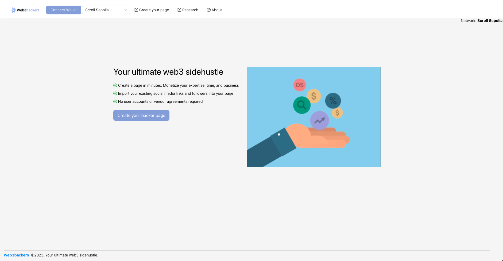

    

 

Web3backers
---

Monetize your expertise.

Web3backers connects your existing social accounts and reputation (see lens, linkedin, twitter, etc.) to create a funding page for you to produce and sell content and your time. 

Each page gets its own unique smart contract which tracks user interactions and payments.

Monitor your engagement on-chain using events. Issue community tokens unique to your brand.

A web3 platform for creating content funding similar to onlyfans and patreon but without the middleman.

Example:
Upload
* Chris Buonocore - links to social (lens, twitter).
* Chris is creating web3 tutorials.
* Unlockable content, reveals a cid.
* Get in contact with Chris (XMTP)
* Connect account (Privy)
* Deploy contract per page (Neon, Metamask, Scroll, XDC)
* UMA (user search)?
* Unlock (gated content and connection to XMTP)
* NFT API (quicknode)
* Mask (relationservice search) https://docs.next.id/core-concepts/relation-service/rs-example

### Inspiration

### Core functions
* Landing page
* Create page
* User page
    * Chat page
    * Payment page
    * Content page
* Search page
* About page 

### Example Scroll contract

* url: 
* Example verification url:

<h1>Home</h1>

###

https://docs.privy.io/guide/quickstart
### Possible Sponsors

* Polygon (might be too crowded) - could use account abstraction
* WalletConnect: Authentication, inbox for push nofications. Web3Modal V3 for auth
* Privy: Authentication

Bounty Description:

1inch Developer Portal do have multiple APIs (Balances, Fiat Prices, Portfolio, Swap, Limit Order). Use any of it to enhance your project. Apps with the best use cases will be eligible for bounties

Criteria:

1 - Use portal.1inch.dev APIs (Any of it)

2 - The utilization of 1inch Developer Portal should have a meaningful purpose

Bounty Description:

Develop an innovative DeFi solution on a supported EVM that has a meaningful impact on the community. Your project should introduce novel concepts or functionalities, addressing real-world problems and pushing the boundaries of DeFi

* Filecoin/IPFS: Storage (web3.storage api only likely not enough, needs to use FVM)
* ENS account abstraction (can use cbono.eth)
* Unlock protocol for gated content
* Quicknode NFT API

## Useful links
* Sponsors: https://ethglobal.com/events/newyork2023/prizes

### Running the app

Copy `.env.sample` - `.env`

Define the following environment variables.

<pre>

</pre>

`yarn; yarn dev`

Web3backers should now be running on port 3000.

<b>Note this project is currently a prototype and would require additional work to be production ready on Chainlink mainnet.</b>

### Potential future work

## Screenshots / User flow

### Home

<!--

Demo flow:

Sponsors:

-->

