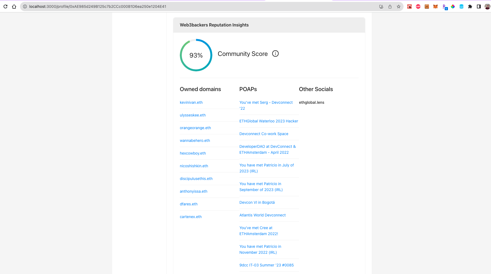

    

 

Web3backers
---

Web3backers connects your existing web3 and web2 social accounts and information (see ENS< lens, linkedin, twitter, github, on-chain, etc.) to create a funding page for you to drive product sales and paid consults based on your combined reputation.

Web3backers pulls information from your existing web3 and web2 networks to create a patreon-like experience without the 10% fees. Get clients and drive an alternative source of revenue.

Three big pieces are:
1. Creating a monetization-focused site for web3 creators and builders without requiring starting over on a greenfield platform.
2. Every web3backer profile page has its own smart contract deployed on either low cost or high through L1/L2 networks such as scroll, neon, and filecoin. 
3. The shareable profile page gives you an overall network score based on data from Airstack and Next.ID. Content such as courses can be sold, or a chat opened up directly from the page on XMTP with the creator's wallet address (no emails required).

<!-- Monetize your expertise. -->

<!-- Example:
Upload
* Chris Buonocore - links to social (lens, twitter).
* Chris is creating web3 tutorials.
* Unlockable content, reveals a cid.
* Get in contact with Chris (XMTP)
* Connect account (Privy)
* Deploy contract per page (Neon, Metamask, Scroll, XDC)
* Unlock (gated content and connection to XMTP)
* NFT API (quicknode)
* Mask (relationservice search) https://docs.next.id/core-concepts/relation-service/rs-example -->

Note this project is currently a prototype and would require additional work to be production ready.

### Inspiration

### Core functions
* Landing page
* Create page
* User page
    * Chat page
    * Payment page
    * Content page
* Search page
* About page 

### Example Web3backers contract

Sepolia: 0xb1F35230c645C12Bc3066dcdcd774E704983d208
Verification: `cd contracts; yarn verify-sepolia 0xb1F35230c645C12Bc3066dcdcd774E704983d208`

### Example profile page

http://localhost:3000/profile/0x0ad760921240F5d6e4dFF7E1d851A5577ea7f55D

* url: 
* Example verification url:

<h1>Home</h1>

###

https://docs.privy.io/guide/quickstart
### Technologies used

Technologies and how they are used:
* Filecoin/IPFS: Contract deployment compatible with FEVM. Filecoin also serves uploaded content and the smart contract provides an access barrier to the addressed content based on cid.
* Scroll: Contract deployment on L2. Low cost and L2 networks helps reduce transaction fees and improve scalability, making it cost-effective for users and creators to interact with the platform. Scroll adds a level of auditability to all interactions with the profile page.
* Neon: Contract deployment. Payments for consulting fees can be handled through the platform without the need for email addresses. Neon adds a level of auditability to all interactions with the profile page.
** Airstack: Profiles and social. This entire app is around abstracting addresses and focusing on identity and social credability. Used for the research tab and getting information about potential Web3backers. Mixed with Next.ID for web2 elements, Airstack allows importing a user's social identity into the app without needing recreation. Also used on main profile page.
* Mask/Next.id: Profiles and social APIs. This entire app is around abstracting addresses and focusing on identity and social credability. Mixed with Airstack, mask/next.id API allow importing a user's social identity into the app without needing recreation. Used to hydrate main profile page.
* Privy: Privy is part of the root of the appliacation. Authentication experience and transaction signing regardless of wallet. Privy provides a simple user experience for accessing the app and data on the connected smart contracts regardless of network.
* XMTP: XMTP is used for chat functionality within the platform. Users can open direct chats with creators, potentially for consultation or communication related to services or content. 
* ENS: account abstraction (maps the address -> ENS profile and avatar).
* QuickNode: Used on the infrastructure side. Added an RPC endpoint with scroll for more availability and performance compared to public networks.
## Useful links
* Sponsors: https://ethglobal.com/events/newyork2023/prizes

### Running the app

Copy `.env.sample` - `.env`

Define the included environment variables with your own custom values. This includes keys for filecoin storage, privy authentication, airstack, etc.

`yarn; yarn dev`

Web3backers should now be running on port 3000.

<!-- <b>Note this project is currently a prototype and would require additional work to be production ready on Chainlink mainnet.</b> -->

### Deployment

1. `yarn build` to generate a production build (note that you must set all env variables in .env).
2. `yarn deploy` is currently set to use surge.sh. Feel free to replace with the distributed host of your choosing.

### Potential future work

## Screenshots / User flow

            

<!--

Demo flow:

Sponsors:

-->

